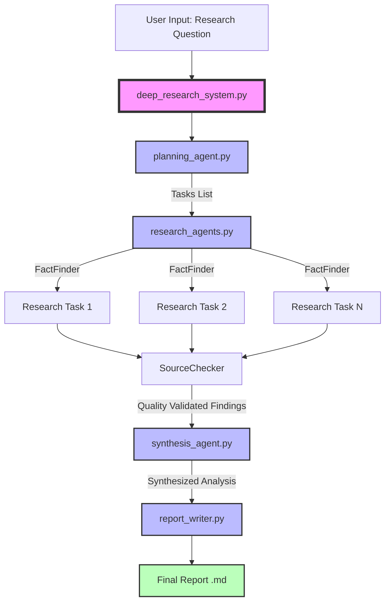

# 📚 Deep Research System - Complete Documentation

## 📋 Table of Contents
1. [System Overview](#system-overview)
2. [Architecture & Flow](#architecture--flow)
3. [Component Hierarchy](#component-hierarchy)
4. [Agent Relationships](#agent-relationships)
5. [Testing Guide](#testing-guide)
6. [Expected Outputs](#expected-outputs)
7. [Troubleshooting](#troubleshooting)

---

## 🎯 System Overview

The **Deep Research System** is a multi-agent AI research platform that automates complex research tasks using Google's Gemini AI. It breaks down research questions into manageable tasks, conducts detailed research, synthesizes findings, and generates professional reports.

### Core Components

| Component | Purpose | Primary Function |
|-----------|---------|------------------|
| `deep_research_system.py` | Main Orchestrator | Coordinates all agents and manages workflow |
| `planning_agent.py` | Task Planner | Breaks complex questions into research tasks |
| `research_agents.py` | Research Executor | Conducts research and validates quality |
| `synthesis_agent.py` | Data Synthesizer | Combines findings into coherent analysis |
| `report_writer.py` | Report Generator | Creates professional formatted reports |

---

## 🏗️ Architecture & Flow

### System Flow Diagram



### Execution Pipeline

```
1. INPUT PHASE
   └── User provides research question
   
2. PLANNING PHASE (planning_agent.py)
   ├── Breaks question into 3-5 tasks
   ├── Extracts patterns and context
   └── Returns structured task list

3. RESEARCH PHASE (research_agents.py)
   ├── FactFinder
   │   ├── Executes each task
   │   ├── Applies caching (24hr)
   │   └── Generates findings
   └── SourceChecker
       ├── Validates quality
       └── Rates findings

4. SYNTHESIS PHASE (synthesis_agent.py)
   ├── Combines all findings
   ├── Extracts patterns
   ├── Resolves contradictions
   └── Creates narrative

5. REPORT PHASE (report_writer.py)
   ├── Formats content
   ├── Adds citations
   ├── Generates metadata
   └── Saves to file

6. OUTPUT PHASE
   └── Delivers formatted .md report
```

---

## 🎨 Component Hierarchy

### Class Structure

```
DeepResearchSystem (deep_research_system.py)
│
├── PlanningAgent (planning_agent.py)
│   ├── __init__()
│   ├── break_down_question()
│   ├── _parse_tasks()
│   ├── _generate_fallback_tasks()
│   └── validate_connection()
│
├── FactFinder (research_agents.py)
│   ├── __init__()
│   ├── run()
│   ├── _create_research_prompt()
│   ├── _validate_findings()
│   ├── _get_cached_result()
│   └── _cache_result()
│
├── SourceChecker (research_agents.py)
│   ├── __init__()
│   ├── run()
│   ├── _quick_quality_check()
│   └── _heuristic_assessment()
│
├── SynthesisAgent (synthesis_agent.py)
│   ├── __init__()
│   ├── synthesize_research()
│   ├── _prepare_findings()
│   ├── _extract_patterns()
│   ├── _create_synthesis_prompt()
│   └── _validate_synthesis()
│
└── ReportWriter (report_writer.py)
    ├── __init__()
    ├── write_report()
    ├── add_citation()
    ├── _generate_detailed_report()
    ├── _generate_executive_report()
    ├── _format_final_report()
    └── _save_report_to_file()
```

---

## 🔗 Agent Relationships

### Data Flow Between Agents

```yaml
deep_research_system.py:
  receives: "User Question"
  sends_to: planning_agent
  
planning_agent.py:
  receives: "User Question"
  returns: ["Task 1", "Task 2", "Task 3", ...]
  
research_agents.py:
  FactFinder:
    receives: "Individual Task"
    returns: "Detailed Findings"
  SourceChecker:
    receives: "Findings"
    returns: "Quality Rating"
    
synthesis_agent.py:
  receives: ["Finding 1", "Finding 2", "Finding 3", ...]
  returns: "Unified Synthesis"
  
report_writer.py:
  receives: "Synthesis" + "Original Query"
  returns: "Formatted Report"
  saves: "report_[timestamp].md"
```

### Dependencies

- **All agents** depend on:
  - `google.generativeai`
  - `python-dotenv`
  - `.env` file with `GEMINI_API_KEY`

- **Cache directories created**:
  - `research_cache/` (FactFinder)
  - `synthesis_cache/` (SynthesisAgent)
  - `report_cache/` (ReportWriter)
  - `research_reports/` (Final reports)

---

## 🧪 Testing Guide

### Prerequisites

```bash
# 1. Install dependencies
pip install google-generativeai python-dotenv

# 2. Create .env file
echo "GEMINI_API_KEY=your-actual-key-here" > .env

# 3. Verify API key
python -c "import os; from dotenv import load_dotenv; load_dotenv(); print('Key found!' if os.getenv('GEMINI_API_KEY') else 'No key!')"
```

### 1️⃣ Test planning_agent.py

**Test Command:**
```bash
python planning_agent.py
```

**Test Code (already in file):**
```python
if __name__ == "__main__":
    test_planning_agent()
```

**Expected Output:**
```
==============================================================
TESTING PLANNING AGENT
==============================================================
   ✅ Planning Agent initialized with Gemini 1.5 Flash
   ✅ API connection verified

📝 Analyzing question: How has artificial intelligence changed healthcare from 2020 to 2024?...
   ✅ Successfully generated 5 research tasks

📋 Generated Research Tasks:
   1. Investigate current AI diagnostic tools being used in major hospitals worldwide
   2. Analyze measurable benefits of AI in improving patient diagnosis accuracy rates
   3. Examine documented concerns from healthcare professionals about AI reliability
   4. Research specific case studies of AI implementation in radiology departments
   5. Evaluate upcoming AI healthcare technologies and their potential impact
```

### 2️⃣ Test research_agents.py

**Test Command:**
```bash
python research_agents.py
```

**Test Code (already in file):**
```python
if __name__ == "__main__":
    test_research_agents()
```

**Expected Output:**
```
==============================================================
TESTING RESEARCH AGENTS
==============================================================
   ✅ FactFinder initialized with Gemini 1.5 Flash
   ✅ SourceChecker initialized with Gemini 1.5 Flash

1. Testing FactFinder:

   🔍 Researching: Investigate current AI diagnostic tools being used in major hospitals...
      ✅ Collected 1847 chars of research

📊 Research Findings Preview:
Recent developments in AI diagnostic tools have transformed major hospitals globally. 
Leading institutions like Mayo Clinic, Johns Hopkins, and Mount Sinai have deployed 
sophisticated AI systems for medical imaging analysis. These tools utilize deep learning...

2. Testing SourceChecker:

📈 Quality Assessment: High Quality: Detailed research with specific information
```

### 3️⃣ Test synthesis_agent.py

**Test Command:**
```bash
python synthesis_agent.py
```

**Test Code (already in file):**
```python
if __name__ == "__main__":
    test_synthesis_agent()
```

**Expected Output:**
```
==============================================================
TESTING SYNTHESIS AGENT
==============================================================
   ✅ SynthesisAgent initialized with Gemini 1.5 Flash

📊 Synthesizing findings...

   🔄 Synthesizing 3 research findings...
      ✅ Synthesized 2156 chars successfully

📝 Synthesis Result Preview:
The comprehensive analysis of AI integration in healthcare reveals a transformative 
period characterized by both remarkable achievements and significant challenges. 
Across multiple research findings, a clear pattern emerges showing that AI diagnostic 
tools have achieved unprecedented accuracy levels, with machine learning models...

✅ Synthesis complete: 2156 characters

🔍 Patterns Found:
   Key Topics: ['healthcare', 'ai', 'diagnostic', 'patient', 'implementation']
   Numbers: ['95%', '30%', '70%', '$150 billion', '25%']
```

### 4️⃣ Test report_writer.py

**Test Command:**
```bash
python report_writer.py
```

**Test Code (already in file):**
```python
if __name__ == "__main__":
    test_report_writer()
```

**Expected Output:**
```
==============================================================
TESTING REPORT WRITER
==============================================================
   ✅ ReportWriter initialized with Gemini 1.5 Flash

📝 Testing Report Generation...

   Generating executive report...
   📝 Generating executive report...
      ✅ Generated 1234 character report
      💾 Report saved: research_reports/report_executive_20240907_143022_How_has_AI.md
   ✅ Executive report generated:
      Length: 3456 characters
      Sections: 5
      Citations: 4

   Generating detailed report...
   📝 Generating detailed report...
      ✅ Generated 3421 character report
      💾 Report saved: research_reports/report_detailed_20240907_143025_How_has_AI.md
   ✅ Detailed report generated:
      Length: 5678 characters
      Sections: 8
      Citations: 4
```

### 5️⃣ Test deep_research_system.py (Full System)

**Test Command:**
```bash
python deep_research_system.py
```

**Expected Full System Output:**
```
==============================================================
  🧠 DEEP RESEARCH SYSTEM v3.0 - INTERACTIVE EDITION
  Powered by Google Gemini AI
==============================================================

✓ Gemini API Key loaded: AIzaSy...

🔧 Initializing AI Agents...
   • Loading Planning Agent...
   ✅ Planning Agent initialized with Gemini 1.5 Flash
   • Loading Research Agents...
   ✅ FactFinder initialized with Gemini 1.5 Flash
   ✅ SourceChecker initialized with Gemini 1.5 Flash
   • Loading Synthesis Agent...
   ✅ SynthesisAgent initialized with Gemini 1.5 Flash
   • Loading Report Writer...
   ✅ ReportWriter initialized with Gemini 1.5 Flash

✅ All agents initialized successfully!

==============================================================
  🧠 DEEP RESEARCH SYSTEM - MAIN MENU
==============================================================

  [1] 🔍 Start New Research
  [2] 📚 View Research History
  [3] 🎯 Quick Research (Predefined Topics)
  [4] ⚙️  Settings & Configuration
  [5] 📖 Help & Examples
  [6] 🚪 Exit

▶️  Select option (1-6): 1

[User enters research question]

📋 PHASE 1/4: RESEARCH PLANNING
✅ Generated 5 research tasks

🔍 PHASE 2/4: CONDUCTING RESEARCH
[Progress bars showing research progress]

🔄 PHASE 3/4: SYNTHESIZING FINDINGS
✅ Synthesized 2345 chars of content

📝 PHASE 4/4: GENERATING REPORT
✅ Report generated successfully!

📊 Summary:
   • Duration: 45.3 seconds
   • Report size: 4567 characters
   • Tasks completed: 5
   • Report saved: research_reports/report_20240907_143022.md
```

---

## 📊 Expected Outputs

### Output Files Structure

```
Project_DeepResearchAgent/
│
├── research_cache/          # FactFinder cache (24hr)
│   ├── a1b2c3d4.txt
│   └── e5f6g7h8.txt
│
├── synthesis_cache/         # SynthesisAgent cache (48hr)
│   ├── s1t2u3v4.txt
│   └── w5x6y7z8.txt
│
├── report_cache/           # ReportWriter cache (72hr)
│   ├── r1e2p3o4.md
│   └── r5t6y7u8.md
│
└── research_reports/       # Final reports (permanent)
    ├── report_executive_20240907_143022_ai_healthcare.md
    ├── report_detailed_20240907_145512_climate_change.md
    └── research_report_20240907_151234.md
```

### Sample Report Structure

```markdown
# 📊 Research Report - Detailed
**Generated:** 2024-09-07 14:30:22  
**Research Question:** How has AI transformed healthcare?  
**Report Type:** Detailed  

---

## Executive Summary
[2-3 paragraphs summarizing key findings]

## Key Findings
[4-5 paragraphs of major discoveries]

## Detailed Analysis
[5-6 paragraphs of in-depth analysis]

## Implications and Impact
[3-4 paragraphs on broader implications]

## Recommendations
[2-3 paragraphs of actionable steps]

## Conclusions
[2-3 paragraphs summarizing learnings]

---

## 📚 References and Citations
### Primary Sources
[1] AI Healthcare Research Study 2024
[2] Medical Journal Analysis

### Supporting Evidence
[3] Expert Interview Findings

### Data Sources
[4] Hospital Implementation Data

---

## 📊 Metadata
- **Report ID:** a1b2c3d4
- **Word Count:** 2,345 words
- **Reading Time:** 12 minutes
```

---

## 🔧 Troubleshooting

### Common Issues & Solutions

| Issue | Solution |
|-------|----------|
| "API_KEY_INVALID" | Regenerate key at https://makersuite.google.com/app/apikey |
| "Model not found" | Use `gemini-1.5-flash` instead of `gemini-pro` |
| "Rate limit exceeded" | Wait 60 seconds, system has automatic delays |
| "No cache directory" | Directories are auto-created on first run |
| Import errors | Run `pip install google-generativeai python-dotenv` |
| Empty reports | Check synthesis content is not empty |
| "No .env file" | Create `.env` with `GEMINI_API_KEY=your-key` |

### Debug Mode

To enable verbose debugging, add to any agent:
```python
import logging
logging.basicConfig(level=logging.DEBUG)
```

### Performance Metrics

| Operation | Expected Time | Cache Hit Time |
|-----------|--------------|----------------|
| Planning | 2-5 seconds | N/A |
| Research per task | 3-7 seconds | <0.1 seconds |
| Synthesis | 5-10 seconds | <0.1 seconds |
| Report Generation | 5-10 seconds | <0.1 seconds |
| **Total (5 tasks)** | **30-60 seconds** | **<5 seconds** |

---

## 🚀 Quick Start Commands

```bash
# 1. Test individual components
python planning_agent.py      # Test planning
python research_agents.py     # Test research
python synthesis_agent.py     # Test synthesis
python report_writer.py       # Test reporting

# 2. Run full system
python deep_research_system.py

# 3. Check cache usage
ls -la research_cache/ synthesis_cache/ report_cache/

# 4. View generated reports
ls -la research_reports/

# 5. Clear all caches (if needed)
rm -rf *_cache/
```

---

## 📈 System Capabilities

### What the System Can Do
- ✅ Break complex questions into manageable tasks
- ✅ Conduct parallel research on multiple topics
- ✅ Synthesize findings from multiple sources
- ✅ Generate professional reports in 4 formats
- ✅ Cache results to minimize API usage
- ✅ Handle failures with intelligent fallbacks
- ✅ Track citations and references
- ✅ Save reports with metadata

### Limitations
- ❌ Cannot access real-time web data (uses AI knowledge)
- ❌ Limited to Gemini's knowledge cutoff
- ❌ Cannot process images or PDFs
- ❌ Subject to API rate limits
- ❌ Maximum context window limitations

---

## 📚 Additional Resources

- **Gemini API Documentation**: https://ai.google.dev/docs
- **API Key Management**: https://makersuite.google.com/app/apikey
- **Python Gemini SDK**: https://github.com/google/generative-ai-python
- **Rate Limits**: 60 requests per minute (free tier)